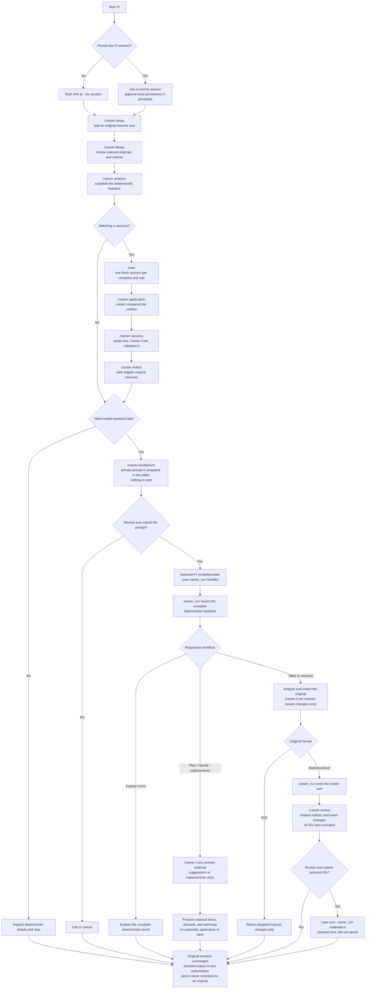

# pi-career

[](https://www.npmjs.com/package/pi-career)
[](https://www.npmjs.com/package/pi-career)
[](https://github.com/revazi/pi-career/actions/workflows/ci.yml)
[](#license-and-provenance)

`pi-career` is a [Pi package](https://github.com/earendil-works/pi) for deterministic resume analysis and conservative vacancy matching, with an optional model-assisted workflow for reviewed resume improvements.

The package's command handlers do not call a model/provider. `/career-workbench` prepares a visible private prompt in Pi's editor, while `/career-review` prepares only an ephemeral review handle and explicitly selected canonical IDs; only the user's later submission invokes the selected Pi model/provider. At runtime, pi-career never uses a Career Core source checkout or Cargo build. Its optional maintainer compatibility test may read an explicitly supplied, reviewed Core fixture checkout.

It gives you:

- local slash commands for setting up a resume library, analyzing originals, and matching them to a vacancy;
- one compact managed agent tool, `career_run`, for guided work after the deterministic baseline;
- a visible workbench handoff that never sends private resume text until you review and submit it yourself;
- bounded TUI inspection and explicit selection of Core-reviewed non-PDF changes without automatic materialization;
- a bounded resolver for a compatible external Career Core runtime;
- no bundled native binary, telemetry, vacancy URL fetching, automatic document overwrite, or hidden provider call.

Career Core remains authoritative for scores, evidence, warnings, uncertainty, matching, and proposal review. `pi-career` owns the Pi workflow and presentation layer; it does not reimplement Career Core algorithms or schemas.

> **Version note:** this README describes `pi-career@0.2.0`. Published `pi-career@0.1.0` is the historical bundled-runtime release. If `0.2.0` is not yet visible on the npm registry, use a reviewed local checkout or pinned Git commit.

## Requirements

- Node.js 22.19 or newer
- Pi with 0.84.0-compatible package APIs
- a reviewed ARM64/x64 target: macOS, GNU/Linux with glibc 2.35+, musl Linux, or MSVC Windows
- either a compatible local `career` executable or network access for first-use acquisition of exact `@revazi/career@0.1.1`

## Install

After the registry confirms the release, install the exact version:

```bash
pi install npm:pi-career@0.2.0
pi list
```

For release-candidate testing, a clean checkout includes reproducible `dist/index.js` and `dist/pdf-worker.js` bundles, so local installation does not require a build or npm install:

```bash
cd /absolute/path/to/pi-career
pi install "$(pwd -P)"
pi list
```

On Windows PowerShell, register the same clean checkout with:

```powershell
pi install (Resolve-Path .).Path
pi list
```

Local-path installation loads the checkout in place. After a reviewed update, restart Pi or run `/reload`.

To pin a reviewed Git commit instead:

```bash
pi install git:github.com/revazi/pi-career@<reviewed-full-commit>
```

Remove the exact source you installed:

```bash
pi remove npm:pi-career

# Or, for a local-path registration:
cd /absolute/path/to/pi-career
pi remove "$(pwd -P)"
```

Developers who modify `src/` must rebuild the tracked bundles with `npm run build`; see [Development](#development).

## Recommended first run

The optimal path starts with deterministic analysis. The model-assisted path begins only if you review and submit the prompt prepared by `/career-workbench`.



### 1. Start with a transient Pi session

For a first test—or whenever you do not want Pi to write this conversation to a session JSONL—start:

```bash
pi --no-session
```

This prevents Pi session persistence for the new run. It is not secure erasure and does not remove shell history, previous sessions, backups, provider copies, or npm cache data.

If you use a normal persisted session, `pi-career` asks for explicit consent before it adds private vacancy/workflow state. A local-session decision is separate from permission to send content to a model provider.

### 2. Configure an originals library

Put one or more original resumes in a dedicated directory. Supported inputs are:

- UTF-8 Markdown (`.md`)
- UTF-8 plain text (`.txt`)
- searchable, unencrypted PDF (`.pdf`), up to 10 MiB and 20 pages

Image-only/scanned PDFs need OCR or export to Markdown/text first. DOCX, Pages, vacancy URLs, and OCR are not supported.

In Pi, run:

```text
/career-setup
```

Choose **Add root** and enter the resume directory. Setup stores the canonical root in private local Pi configuration; it does not copy, move, or edit your resumes.

Setup also displays a preferred `variants/` destination. This is suggestion-only: it creates no directory or file and does not authorize a save.

### 3. Confirm what was indexed

```text
/career-library
```

Review the indexed originals and any notices. Fix unreadable, oversized, invalid UTF-8, encrypted, or image-only documents before continuing.

### 4. Analyze an original before tailoring it

```text
/career-analyze
```

Choose one original resume. The command runs deterministic readiness analysis, shows a compact card, and lets you inspect the complete result or focused sections in a transient viewer.

This is the best first baseline: understand the resume on its own before adding vacancy-specific concerns.

### 5. Use one Pi session per company and role

Start a fresh Pi conversation before each application:

```text
/new
/career-application
```

Enter the company and role. The application context scopes its vacancy and result cards and names an otherwise unnamed Pi session. It does not create an application directory or write career documents.

Then set the vacancy:

```text
/career-vacancy
```

Paste the vacancy text directly. `pi-career` never fetches a vacancy URL. Career Core validates the text before it becomes the current vacancy.

### 6. Match your originals

```text
/career-match
```

Choose all eligible originals or a subset. The command deterministically normalizes the vacancy, analyzes each selected original, matches each original to the vacancy, and then ranks the results conservatively. You can open detailed evidence for a selected row.

Scores and recommendations are bounded workflow guidance—not hiring predictions, ATS guarantees, or evidence that an employer will respond.

### 7. Open the workbench only when you want model-assisted help

```text
/career-workbench
```

Choose an original and a guided mode. The command prepares a private prompt in Pi's normal editor; it does **not** invoke Career Core or a model and sends nothing automatically. Read the prompt and source payload before submitting it.

After you submit, the selected Pi agent uses `career_run` to rerun complete deterministic baselines and Core-review any proposed suggestions, replacements, or vacancy-specific changes. The original remains immutable.

For a non-PDF tailored variation, `career_run variant-review` ends the agent turn. Run `/career-review <review-handle>` to inspect every warning/discard and each exact before/after/evidence record; all retained changes start excluded. Explicitly include the IDs you want, review those selected changes together, and separately confirm the handle/ID-only editor handoff before submitting it as a later turn. The selector never materializes or submits automatically. For PDFs, the workbench returns targeted manual changes only because extracted text cannot preserve typography, columns, spacing, or graphics; PDF review handles cannot enter selection or materialization.

## Slash command reference

The workflow commands below require interactive TUI/RPC mode except `/career-vacancy clear`; `/career-review` is TUI-only and `/career-tools` is a lightweight tool-surface switch. Slash-command handlers do not invoke a model/provider. `/career-workbench` and `/career-review` prepare editor prompts whose later user submission does. Core-backed commands may resolve or acquire the external runtime before processing private input.

### `/career-setup [status]`

Configure and inspect package-level resume-library settings.

Without arguments, the setup menu can:

- add a readable resume root;
- rescan configured roots;
- show setup and scan status;
- set or clear a suggestion-only resume-variation directory.

It stores only canonical root paths, bounded labels, and the optional variation-directory suggestion. It does not install Career Core, create the suggested directory, copy resumes, or write result files.

Use `/career-setup status` to display the current summary and notices without opening the menu.

### `/career-library [status]`

Browse and maintain the configured resume index.

The menu can:

- browse indexed PDF, Markdown, and text records;
- add or remove a root from configuration;
- rescan all configured roots;
- show counts and actionable scan notices.

Removing a root changes configuration only; it never deletes files. Assisted variants with valid sidecars remain visible but are excluded from authoritative analysis and matching. Oversized originals remain visible as unavailable where appropriate.

Use `/career-library status` for a summary without the menu.

### `/career-application [status|clear]`

Create and manage one company/role context for the current Pi session.

A new application records bounded company and role labels, starts at `preparing`, and can later be marked `applied`, `interviewing`, or `closed`. Its immutable application ID scopes the current vacancy and result cards. If the Pi session has no name, the command names it from the company and role.

Use:

- `/career-application status` to show the active context;
- `/career-application clear` to clear the application and its current vacancy.

After clearing—or before working on another company/role—run `/new`. The same Pi session cannot be reused for a second application context because earlier private prompts would still be in that conversation.

This command manages session state only. It does not create workspace folders or application files.

### `/career-vacancy [clear]`

Set, inspect, replace, or clear the current vacancy.

When no vacancy exists, the command opens an editor for pasted text. When one exists, it offers **Replace**, **View**, **Clear**, or **Cancel**. New or replacement text is normalized and validated by Career Core before being stored in workflow state.

The vacancy is bound to the active application when one exists. It must be supplied as text; URLs are never fetched.

Use `/career-vacancy clear` to clear it directly. This is the only career slash-command action allowed without interactive TUI/RPC mode.

### `/career-analyze [filter]`

Run deterministic readiness analysis for one eligible original resume.

The optional filter is a case-insensitive substring matched against the resume label, relative path, and stable ID. For example:

```text
/career-analyze backend
```

After selecting a resume, the command:

1. requests persistence consent when needed;
2. runs the authoritative original-resume analysis;
3. stores only a bounded result card in session state;
4. offers complete/focused transient detail;
5. can prepare a single-resume match command when a vacancy exists;
6. can open the guided workbench for the selected resume.

It never analyzes an assisted variant as an original. Oversized output fails without partial results or hidden file export.

### `/career-match [filter]`

Deterministically rank eligible original resumes against the current vacancy.

Set a vacancy first with `/career-vacancy`. The optional filter uses the same label/relative-path/ID substring matching as `/career-analyze`.

The command lets you choose every matching original or select a subset. It then runs, sequentially:

1. vacancy normalization;
2. readiness analysis for every selected original;
3. original-resume/vacancy matching for every selected original;
4. stable conservative ranking and tie display.

The summary keeps unavailable oversized results visible instead of silently dropping them. Select a ranked row to inspect scores, strengths, gaps, confidence, warnings, evidence, and vacancy context.

Assisted variants are never accepted as authoritative match inputs.

### `/career-workbench [filter]`

Prepare a visible, guided prompt for the selected Pi agent.

The optional resume filter behaves like `/career-analyze`. Available modes are:

- **Explain my score** — rerun and explain the complete deterministic analysis;
- **Create a reviewed improvement plan** — propose at most three advisory suggestions and Core-review them once;
- **Guided rewrite interview** — ask a small set of factual questions first, wait for your answers, then review bounded exact replacements in a later turn;
- **Draft reviewed replacements** — propose and Core-review bounded before/after replacements without claiming they were applied;
- **Create a tailored variation** — available when a current vacancy exists; analyze and match the original, then review vacancy-grounded changes;
- **Ask my own question** — prepare a custom resume-only request under the same safety rules.

The command itself calls neither Career Core nor a provider. It puts the complete selected resume—and the vacancy only for tailoring—into Pi's editor. Nothing is sent until you submit. Submitting may persist that message and send it to the provider selected in Pi.

`pi-career` currently does not save the resulting variation to disk.

### `/career-review <review-handle>`

Review and explicitly select retained changes from a current non-PDF `career_run variant-review` result. This command is available only in TUI mode and only while the ephemeral review handle remains in the current process/session branch.

The bounded selector:

- requires inspection/acknowledgment of all Core warnings and discarded-change reasons;
- shows every canonical change as excluded by default;
- opens a paged exact view of its before text, proposed after text, line bounds, resume evidence, and vacancy evidence;
- includes a change only after you toggle it from that exact view;
- requires at least one included canonical ID before continuing;
- pages all selected exact changes together in a compact labeled view and requires a separate final prepare choice, with a back option for revisions.

Only that final prepare choice creates a short editor message containing the review handle and selected IDs. It does not invoke Career Core, materialize a result, contact a provider, append selection state to the Pi session, save a result, or write a file. Review and submit that editor message manually to start the later materialization turn. Escape cancels without preparing anything.

PDF review changes remain manual-application guidance and are rejected by both `/career-review` and `career_run materialize`.

### `/career-tools [managed|raw|status]`

Control which Career tools are active in model context.

- `/career-tools managed` keeps only the compact `career_run` workflow active. This is the default and recommended mode.
- `/career-tools raw` also activates `career_core_discover`, `career_core_resume`, and `career_core_job` for explicit schema/debugging work.
- `/career-tools status` reports the current tool mode.

This command changes only the active model-tool surface. It does not change slash-command behavior, runtime resolution, privacy boundaries, or compatibility validation.

## Managed agent workflow

Normal users do not need to call raw JSON tools. The package's Agent Skill instructs Pi to use `career_run`:

1. `context` obtains ephemeral handles for eligible originals and the current vacancy;
2. `analyze` and `match` return compact projections backed by complete in-memory Core results;
3. suggestion, replacement, and variant proposals must pass the corresponding Core review command;
4. `detail` hydrates only the requested evidence, warning, check, change, document, or raw section;
5. non-PDF `variant-review` ends its turn so `/career-review` can collect an explicit local selection and prepare a later user message;
6. `materialize` requires that unchanged review handle and exactly the user-selected retained IDs.

Handles and complete results remain bounded in process memory and disappear on session/branch replacement, reload, or shutdown. They are not result files and cannot be reconstructed safely from chat text.

The raw tools are retained for advanced compatibility work only:

- `career_core_discover`
- `career_core_resume`
- `career_core_job`

When raw mode is explicitly enabled, discovery-first use remains mandatory: capabilities → operations → schema list/export/bundle → exact JSON input.

## External Career Core runtime

`pi-career` contains no native Career Core binary. A Core-backed command resolves a compatible runtime in this fixed order:

1. absolute `CAREER_CLI_PATH`;
2. `career` on `PATH`;
3. package-local exact `@revazi/career@0.1.1`;
4. bounded acquisition of exact `@revazi/career@0.1.1` from the canonical npm registry.

Runtime installation is separate from loading the local Pi package. `/career-setup`, `/career-library`, `/career-application`, `/career-workbench`, and `/career-review` itself do not resolve or invoke Core; `/career-review` requires a still-live review produced earlier by `career_run`. `/career-vacancy`, `/career-analyze`, `/career-match`, `career_run`, and the raw tools do need Core.

Before private document stdin opens, the selected executable must pass the exact managed Career Core 0.1.1 operation and schema compatibility checks. An invalid explicit `CAREER_CLI_PATH` fails without fallback. On Windows, the PATH route remains direct-argv-only and selects a native `career.exe`; npm command shims are not executed through a caller-selected shell.

The exact launcher target matrix is:

| Operating system | Architecture | Runtime target | Requirement |
| --- | --- | --- | --- |
| macOS | ARM64 | `darwin-arm64` | native Apple silicon |
| macOS | x64 | `darwin-x64` | native Intel |
| GNU/Linux | x64 | `linux-x64-gnu` | glibc 2.35+ |
| GNU/Linux | ARM64 | `linux-arm64-gnu` | glibc 2.35+ |
| musl Linux | x64 | `linux-x64-musl` | detected musl runtime |
| musl Linux | ARM64 | `linux-arm64-musl` | detected musl runtime |
| Windows | x64 | `win32-x64-msvc` | native MSVC Windows |
| Windows | ARM64 | `win32-arm64-msvc` | native MSVC Windows |

The platform-specific optional packages are internal launcher details; install or acquire only exact `@revazi/career@0.1.1`.

To prohibit acquisition:

```bash
PI_OFFLINE=1 pi --no-session
```

On Windows PowerShell:

```powershell
$env:PI_OFFLINE = "1"
pi --no-session
```

Offline Core-backed use then requires a compatible `CAREER_CLI_PATH`, `career` on `PATH`, or package-local launcher. Acquisition receives no resume or vacancy input, but it may leave ordinary npm cache or `_npx` data; this is not secure erasure.

## Privacy and persistence

Use `pi --no-session` when you do not want a new Pi session JSONL. In a persisted session, review the package's consent prompt before continuing with private content.

Possible persistence surfaces are distinct:

- **Package config:** canonical resume-root paths, bounded labels, and an optional variation-directory suggestion; never resume text, vacancy text, or full Core output.
- **Pi session:** consent, application/vacancy workflow entries, bounded result cards, and potentially tool arguments/results or submitted workbench messages.
- **Model provider:** only content you submit through ordinary Pi model interaction; `/career-workbench` makes the private payload visible before submission, while `/career-review` prepares only an ephemeral handle and selected canonical IDs.
- **npm cache:** ordinary package-acquisition data, never private Career Core stdin.

`pi-career` does not create payload/result temporary files, export full Core JSON, overwrite originals, or automatically save assisted resumes. Searchable PDF extraction is local, bounded, and network-disabled.

See [`SECURITY.md`](SECURITY.md), [`docs/design.md`](docs/design.md), and [`docs/product-flow.md`](docs/product-flow.md) for the complete boundary and threat model.

## Current limitations

- Supported original formats: searchable PDF, Markdown, and UTF-8 text.
- No OCR, DOCX/Pages editing, vacancy URL fetching, or PDF layout reconstruction.
- No automatic resume or application-workspace saving.
- PDF workbench output is targeted manual guidance only.
- Assisted variants remain non-authoritative and cannot be reranked as originals.
- Matching is conservative workflow guidance, not a hiring prediction or proprietary ATS simulation.
- Reviewed external native targets are `darwin-arm64`, `darwin-x64`, `linux-x64-gnu`, `linux-arm64-gnu`, `linux-x64-musl`, `linux-arm64-musl`, `win32-x64-msvc`, and `win32-arm64-msvc`.

The future application-workspace contract is documented in [`docs/application-workspaces.md`](docs/application-workspaces.md); those filesystem-writing phases are not implemented.

## Development

TypeScript under `src/` is authoritative. `dist/index.js` and `dist/pdf-worker.js` are reproducible tracked bundles for clean local and Git loading.

```bash
npm ci
npm run build
git diff --exit-code -- dist/index.js dist/pdf-worker.js
npm run bench:tokens
npm run check
npm run test:runtime-resolution
npm run test:career-package
npm run audit:production
npm run audit:full
npm run check:publish
PI_OFFLINE=1 npm run test:pi-smoke
PI_OFFLINE=1 npm run test:install
npm run test:compat
git diff --check
```

`npm run test:career-package` is the network-capable exact-package integration test. `npm run test:compat` skips unless an explicitly reviewed fixture checkout is provided:

```bash
CAREER_CORE_FIXTURE_ROOT=/absolute/path/to/reviewed/career-core \
  npm run test:compat
```

`npm run build` rebuilds JavaScript bundles only; it never builds or downloads native runtimes. `npm run check:publish` verifies readiness and package contents but does not publish anything.

## Security and release provenance

The exact reviewed external runtime coordinate is [`@revazi/career@0.1.1`](https://www.npmjs.com/package/@revazi/career/v/0.1.1), published from Career Core commit [`0318b3b0993ee23093c8f023757fa7e4d8b3b8e0`](https://github.com/revazi/career-core/tree/0318b3b0993ee23093c8f023757fa7e4d8b3b8e0). Its launcher owns native target/libc selection and package metadata, provenance, mode or Windows file invariant, size, format, and SHA-256 verification.

Historical published `pi-career` v0.1.0 coordinates are retained for verification:

- npm: [`pi-career@0.1.0`](https://www.npmjs.com/package/pi-career/v/0.1.0)
- Git commit: [`967da62503bc8a97c070946f6506ea3471baeb34`](https://github.com/revazi/pi-career/tree/967da62503bc8a97c070946f6506ea3471baeb34)
- npm integrity: `sha512-mmbDdWDyWz77f2uLzZECJT9E6w1ZRCJjYFrUnZd3ldoS6ehEa5DrCENIfavHR5xMOFi0of6AVQ35ZTxwpeDeAQ==`
- GitHub Release: [`v0.1.0`](https://github.com/revazi/pi-career/releases/tag/v0.1.0)

That historical release bundled native artifacts; `pi-career@0.2.0` does not. Historical evidence remains in [`docs/native-dependency-inventory.md`](docs/native-dependency-inventory.md), [`docs/releasing.md`](docs/releasing.md), and [`docs/licenses/`](docs/licenses/).

Use [Issues](https://github.com/revazi/pi-career/issues) only for sanitized bugs and scoped feature requests. Follow [`SECURITY.md`](SECURITY.md) for private vulnerability reports. Never attach real resumes, vacancies, credentials, provider responses, or Pi session files to a public issue.

## License and provenance

Licensed under either Apache-2.0 or MIT, at your option. See [`LICENSE-APACHE`](LICENSE-APACHE), [`LICENSE-MIT`](LICENSE-MIT), and [`NOTICE`](NOTICE).

The external `@revazi/career` distribution carries its own native licenses and notices.
